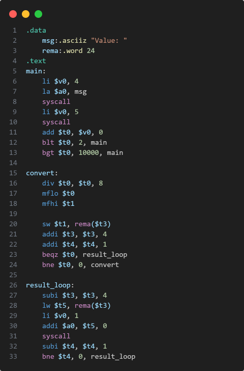

# vscode-mips 
This extension provides basic MIPS Assembly support for Visual Studio Code.

## Features
- Syntax highlighting for MIPS instructions and pseudo-instructions.
- Run MIPS code directly from VS Code using the MARS simulator.
- Snippets.

## Screenshot

## License
[MIT](LICENSE)
